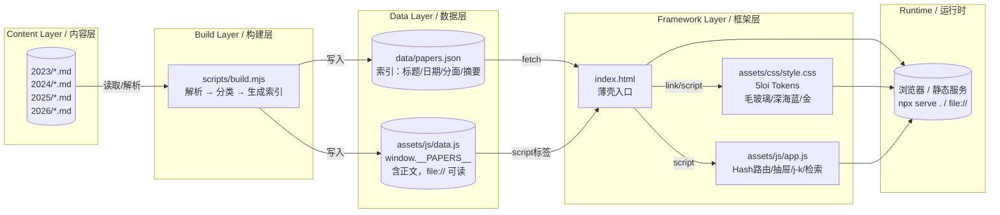

# DeepSeek 研究长卷 · Research Scroll

[](LICENSE)
[](README.md#license)
[](.github/workflows/ci.yml)
<!-- [](https://intentlink.github.io/deepseek-news-research/) -->
<!-- [](https://github.com/intentlink/deepseek-news-research/stargazers) -->

> **在压缩与稀疏之间，解码 DeepSeek 的纹理。**  
> **Decoding DeepSeek's texture between compression and sparsity.**

本仓库系统性分析 2023–2026 年 DeepSeek 全部 31 篇重要研究，以**内容与框架分离**的数字长卷呈现。

> **非官方声明**：本项目非 DeepSeek-AI 官方维护；论文版权归原作者；分析内容以 `CC BY 4.0` 共享，代码以 `MIT` 共享。

<p align="center">
  
</p>

---

## 🎯 核心特性 | Core Features

| 特性 | Feature | 说明 |
|------|---------|------|
| **零构建即用** | Zero-build | `npx serve .` 或 `python3 -m http.server 8000` 即得生产级体验 |
| **file:// 可读** | Works offline | 正文嵌入 `assets/js/data.js`，双击 `index.html` 直接阅读 |
| **内容即 Markdown** | Content = Markdown | 新增论文只需在 `2026/` 下放 `.md`，运行 `node scripts/build.mjs` |
| **框架独立迭代** | Decoupled framework | 视觉改 `assets/css/style.css`，交互改 `assets/js/app.js`，互不干扰 |
| **沉浸式阅读** | Immersive reading | 抽屉式长卷、自动目录、arXiv/GitHub 直达、j/k 翻篇、hash 分享 |
| **多维检索** | Multi-facet search | 年份 / 7 大技术分面 / 全文搜索 / 结果计数 |

---

## 🚀 快速开始 | Quick Start

```bash
# 1. 克隆
git clone https://github.com/intentlink/deepseek-news-research.git
cd deepseek-news-research

# 或使用 GitHub CLI
gh repo clone intentlink/deepseek-news-research

# 2. 本地预览（任选其一）
npx serve .              # http://localhost:3000
# 或
python3 -m http.server 8000   # http://localhost:8000
# 或 直接双击 index.html（file:// 模式）

# 3. 新增一篇论文
# 在 2026/ 下创建 my-paper.md（参考模板）→ 运行构建 → 刷新即见
node scripts/build.mjs
```

---

## 📚 研究索引 | Paper Index (31 Papers)

<details>
<summary><b>2026 (4)</b></summary>

| 论文 | 日期 | 分面 | 链接 |
|------|------|------|------|
| DeepSeek-V4: Million-Token Context | 2026-06-24 | `architecture` `long-context` | [arXiv](https://arxiv.org/abs/2606.19348) · [MD](2026/deepseek-v4-million-token.md) |
| DualPath: Storage Bandwidth Bottleneck | 2026-02-25 | `infrastructure` | [arXiv](https://arxiv.org/abs/2602.21548) · [MD](2026/dualpath-storage-bandwidth.md) |
| DeepSeek-OCR 2: Visual Causal Flow | 2026-01-28 | `multimodal` | [arXiv](https://arxiv.org/abs/2601.20552) · [MD](2026/deepseek-ocr-2.md) |
| Engram: Conditional Memory | 2026-01-12 | `architecture` | [arXiv](https://arxiv.org/abs/2601.07372) · [MD](2026/engram-conditional-memory.md) |

</details>

<details>
<summary><b>2025 (11)</b></summary>

| 论文 | 日期 | 分面 | 链接 |
|------|------|------|------|
| mHC: Manifold-Constrained Hyper-Connections | 2025-12-31 | `architecture` | [arXiv](https://arxiv.org/abs/2512.24880) · [MD](2025/mhc-manifold-constrained.md) |
| DeepSeek-V3.2: Open LLMs Frontier | 2025-12-02 | `reasoning` `architecture` | [arXiv](https://arxiv.org/abs/2512.02556) · [MD](2025/deepseek-v3-2-open-llms.md) |
| DeepSeekMath-V2: Self-Verifiable Reasoning | 2025-11-27 | `math` `reasoning` | [arXiv](https://arxiv.org/abs/2511.22570) · [MD](2025/deepseekmath-v2-self-verifiable.md) |
| Linear-Programming Load Balancer (LPLB) | 2025-11-01 | `infrastructure` | [GitHub](https://github.com/deepseek-ai/LPLB) · [MD](2025/linear-programming-load-balancer.md) |
| DeepSeek-OCR: Contexts Optical Compression | 2025-10-21 | `multimodal` `long-context` | [arXiv](https://arxiv.org/abs/2510.18234) · [MD](2025/deepseek-ocr-contexts-optical-compression.md) |
| Insights into DeepSeek-V3 Scaling | 2025-05-14 | `infrastructure` `architecture` | [arXiv](https://arxiv.org/abs/2505.09343) · [MD](2025/insights-deepseek-v3-scaling-challenges.md) |
| DeepSeek-Prover-V2: Formal Math Reasoning | 2025-04-30 | `math` `reasoning` | [arXiv](https://arxiv.org/abs/2504.21801) · [MD](2025/deepseek-prover-v2-advancing-formal-math-reasoning.md) |
| OpenInfra Week: 7 Core Projects | 2025-02-24 | `infrastructure` | [GitHub](https://github.com/deepseek-ai/open-infra-index) · [MD](2025/openinfra-week.md) |
| Native Sparse Attention (NSA) | 2025-02-16 | `long-context` `architecture` | [arXiv](https://arxiv.org/abs/2502.11089) · [MD](2025/native-sparse-attention-nsa.md) |
| Janus-Pro: Unified Multimodal | 2025-01-29 | `multimodal` | [arXiv](https://arxiv.org/abs/2501.17811) · [MD](2025/janus-pro-unified-multimodal.md) |
| DeepSeek-R1: RL for Reasoning | 2025-01-22 | `reasoning` | [arXiv](https://arxiv.org/abs/2501.12948) · [MD](2025/deepseek-r1-incentivizing-reasoning.md) |

</details>

<details>
<summary><b>2024 (14)</b></summary>

| 论文 | 日期 | 分面 | 链接 |
|------|------|------|------|
| DeepSeek-V3 Technical Report | 2024-12-26 | `architecture` | [arXiv](https://arxiv.org/abs/2412.19437) · [MD](2024/deepseek-v3-technical-report.md) |
| DeepSeek-VL2: MoE Vision-Language | 2024-12-13 | `multimodal` `architecture` | [arXiv](https://arxiv.org/abs/2412.10302) · [MD](2024/deepseek-vl2-mixture-experts-vision-language.md) |
| JanusFlow: Autoregression + Rectified Flow | 2024-11-13 | `multimodal` | [arXiv](https://arxiv.org/abs/2411.07975) · [MD](2024/janusflow-harmonizing-autoregression-rectified-flow.md) |
| Janus: Decoupled Visual Encoding | 2024-10-17 | `multimodal` | [arXiv](https://arxiv.org/abs/2410.13848) · [MD](2024/janus-decoupling-visual-encoding.md) |
| Auxiliary-Loss-Free Load Balancing | 2024-08-28 | `architecture` | [arXiv](https://arxiv.org/abs/2408.15664) · [MD](2024/auxiliary-loss-free-load-balancing-moe.md) |
| Fire-Flyer AI-HPC: Co-Design | 2024-08-26 | `infrastructure` | [arXiv](https://arxiv.org/abs/2408.14158) · [MD](2024/fire-flyer-ai-hpc-cost-effective.md) |
| DeepSeek-Prover-V1.5: Proof Assistant | 2024-08-15 | `math` `reasoning` | [arXiv](https://arxiv.org/abs/2408.08152) · [MD](2024/deepseek-prover-v1-5-harnessing-proof-assistant.md) |
| ESFT: Expert Specialized Fine-Tuning | 2024-07-02 | `architecture` | [arXiv](https://arxiv.org/abs/2407.01906) · [MD](2024/esft-expert-specialized-fine-tuning.md) |
| DeepSeek-Coder-V2: Breaking Closed-Source | 2024-06-17 | `code` | [arXiv](https://arxiv.org/abs/2406.11931) · [MD](2024/deepseek-coder-v2-breaking-barrier-closed-source.md) |
| DeepSeek-Prover: Theorem Proving | 2024-05-20 | `math` `reasoning` | [arXiv](https://arxiv.org/abs/2405.14333) · [MD](2024/deepseek-prover-advancing-theorem-proving.md) |
| DeepSeek-V2: Strong, Economical, Efficient MoE | 2024-05-07 | `architecture` | [arXiv](https://arxiv.org/abs/2405.04434) · [MD](2024/deepseek-v2-strong-economical-efficient-moe.md) |
| DeepSeek-VL: Real-World Vision-Language | 2024-03-11 | `multimodal` | [arXiv](https://arxiv.org/abs/2403.05525) · [MD](2024/deepseek-vl-towards-real-world-vision-language.md) |
| DeepSeekMath: Pushing Math Reasoning Limits | 2024-02-05 | `math` `reasoning` | [arXiv](https://arxiv.org/abs/2402.03300) · [MD](2024/deepseekmath-pushing-limits-math-reasoning.md) |
| DeepSeekMoE: Ultimate Expert Specialization | 2024-01-11 | `architecture` | [arXiv](https://arxiv.org/abs/2401.06066) · [MD](2024/deepseekmoe-towards-ultimate-expert-specialization.md) |

</details>

<details>
<summary><b>2023 (2)</b></summary>

| 论文 | 日期 | 分面 | 链接 |
|------|------|------|------|
| DeepSeek LLM: Scaling with Longtermism | 2023-11-29 | `architecture` | [arXiv](https://arxiv.org/abs/2401.02954) · [MD](2023/deepseek-llm-scaling-open-source.md) |
| DeepSeek Coder: Let Code Write Itself | 2023-11-02 | `code` | [arXiv](https://arxiv.org/abs/2401.14196) · [MD](2023/deepseek-coder-let-code-write-itself.md) |

</details>

---

## 🏗 架构概览 | Architecture



```
.
├── index.html                 # 薄壳入口
├── assets/
│   ├── css/style.css          # 5loi 美学（深海蓝 #0a1628 / 金 #c9a962 / 毛玻璃）
│   └── js/
│       ├── data.js            # 索引 + 正文嵌入（build 生成，file:// 可读）
│       └── app.js             # 交互：hash 路由 / 抽屉 / j-k / 检索
├── data/papers.json           # 索引（build 生成，供 fetch）
├── scripts/build.mjs          # 内容→索引构建器（唯一需跑的命令）
├── 2023/ 2024/ 2025/ 2026/    # 内容区（每篇一个 .md）
├── docs/                      # 深度文档
│   ├── ARCHITECTURE.md        # 框架设计
│   ├── CONTENT_GUIDE.md       # 写作规范
│   ├── FRAMEWORK_GUIDE.md     # 框架扩展
│   └── PUBLISH.md             # 发布流程
└── README.md
```

**数据流**：`*.md` → `scripts/build.mjs` → `data/papers.json` + `assets/js/data.js` → `index.html` 渲染

---

## 🎨 5loi 设计语言 | Design Language

| Token | 值 | 用途 |
|-------|-----|------|
| `--ink` | `#0a1628` | 深海蓝底 |
| `--gold` | `#c9a962` | 主强调色 |
| `--gold-light` | `#e8d4a8` | 高亮/悬停 |
| `--mist` | `#9ca3af` | 次级文本 |
| `--frost` | `rgba(255,255,255,.06)` | 毛玻璃卡片 |
| `--border` | `rgba(201,169,98,.15)` | 分割线 |

> 完整 Token 见 `assets/css/style.css:1-50`。修改仅需改此处，无需重构。

---

## 📖 文档导航 | Documentation

| 文档 | 受众 | 说明 |
|------|------|------|
| [CONTENT_GUIDE.md](docs/CONTENT_GUIDE.md) | 研究者 | 模板、命名、链接、分类、质量检查 |
| [FRAMEWORK_GUIDE.md](docs/FRAMEWORK_GUIDE.md) | 前端工程师 | CSS/JS 扩展、Token、组件、性能 |
| [ARCHITECTURE.md](docs/ARCHITECTURE.md) | 架构师 | 数据流、渲染管线、部署、扩展点 |
| [PUBLISH.md](docs/PUBLISH.md) | 维护者 | 版本发布、Pages 部署、自动化 |

---

## 🤝 贡献指南 | Contributing

详见 [CONTRIBUTING.md](CONTRIBUTING.md) 与 [CODE_OF_CONDUCT.md](CODE_OF_CONDUCT.md)。

### 两类贡献

| 类型 | 目录 | 指南 |
|------|------|------|
| **内容** | `2023/`–`2026/` | [CONTENT_GUIDE.md](docs/CONTENT_GUIDE.md) |
| **框架** | `assets/` `scripts/` `index.html` | [FRAMEWORK_GUIDE.md](docs/FRAMEWORK_GUIDE.md) |

### PR 清单

```bash
git checkout -b add-paper-xxx
# 编辑内容或框架
node scripts/build.mjs          # 内容变更必跑
npm run lint                    # markdownlint
# 提交时包含生成物：data/papers.json assets/js/data.js
git commit -m "docs: add xxx"   # 或 feat: / fix:
```

CI 会自动检查：`markdownlint` + `lychee` 链接有效性 + `build` 一致性。

---

## 📄 许可证 | License

| 部分 | 许可证 | 文件 |
|------|--------|------|
| 代码（`assets/` `scripts/` `index.html`） | MIT | [LICENSE](LICENSE) |
| 内容（`2023/`–`2026/` 分析笔记） | CC BY 4.0 | 署名 `DeepSeek News Research` 并保留原论文引用 |
| 商标 | — | `DeepSeek` 为原厂商商标，本项目非官方 |

---

## 🙏 致谢 | Acknowledgments

- **DeepSeek-AI** 发布的开创性研究与开源模型
- **5loi.com** 提供视觉灵感与设计语言
- **marked** / **GitHub Pages** / **jsDelivr** 等基础设施
- 所有提交 Issue、PR、修正错别字的贡献者

---

<div align="center">

**如果这个长卷对你有帮助，请给个 ⭐ Star 支持持续维护。**

*Made with 5loi aesthetic · Content & Framework Decoupled*

</div>

---
