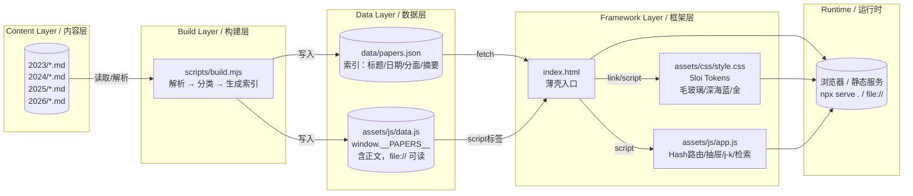

# 架构 · Architecture — 内容与框架分离

> 目标：让你只写 Markdown，框架可独立演进；访客拉取后即开即用，无乱码。



## 1. 设计原则

- **内容即 Markdown**：`2023/`–`2026/` 下每个 `.md` 是唯一可信源。
- **框架薄壳**：`index.html` 仅 230 行，不含数据；视觉与交互外置。
- **生成物可复现**：`data/papers.json` + `assets/js/data.js` 由 `scripts/build.mjs` 一键生成，CI 校验一致性。

## 2. 目录（独立开源根）

```
deepseek-news-research/          # 开源根（https://github.com/intentlink/deepseek-news-research）
├── index.html                   # 薄壳：引入 css/js，含 5loi 式 hero/长卷容器
├── assets/
│   ├── css/style.css            # 视觉：5loi tokens #0a1628/#c9a962/毛玻璃 frosted
│   └── js/
│       ├── data.js              # 生成物：索引+正文嵌入，file:// 可读
│       └── app.js               # 交互：检索/抽屉/hash/j-k/TOC
├── data/papers.json             # 生成物：索引（供 fetch）
├── scripts/build.mjs            # 构建器：扫描 md → 生成上两文件
├── 2023/ 2024/ 2025/ 2026/       # 内容
├── docs/                        # 本目录
└── .github/workflows/ci.yml     # 校验
```

## 3. 数据流

```
2026/a.md  ──┐
2025/b.md  ──┤─→  scripts/build.mjs ─→ data/papers.json (元数据)
2024/c.md  ──┤                    └→ assets/js/data.js (元数据+body嵌入)
...        ──┘
index.html + assets/js/app.js  ←  读取 window.__PAPERS__（优先嵌入）或 fetch data/papers.json
```

- `app.js` 优先使用 `window.__PAPERS__`（含 `body`），故 `open index.html` 在 `file://` 下亦可阅读；`fetch` 为回退，拦截 `.md` 直链统一抽屉渲染，根治乱码。

## 4. 视觉体系（5loi.com）

- Tokens `assets/css/style.css:11`：`--background:#0a1628` `--ink-blue:#111e32` `--gold:#c9a962` `--gold-light:#e8d5a3`
- 组件：`frosted` 毛玻璃、`vertical-text` 竖排、`seal` 印章、`link-gold` 下划线动效
- 字体：`LXGW WenKai` + `Cormorant Garamond` + `Noto Serif SC`（与 5loi 一致）

## 5. 交互模型

- **长卷**：`2023–2026` 按时间倒序，`pill` 筛选（年份/分面/搜索）联动
- **抽屉**：`#drawer` 右侧滑入，非 modal，`history.pushState` 支持 ` #paper/<id>` 分享；`j/k` 或 `←/→` 翻篇，`Esc` 关闭，`TOC` 自动生成
- **演进**：`#evolution` 三条时间线（架构/推理/多模态）点击直达长卷

## 6. 边界与取舍

- 不引入打包器（Vite/Next），保持 0 依赖、`npx serve .` 即可
- `HuggingFace` 为组织页时视为有效，不强制特定模型页；`GitHub` 404 已清理
